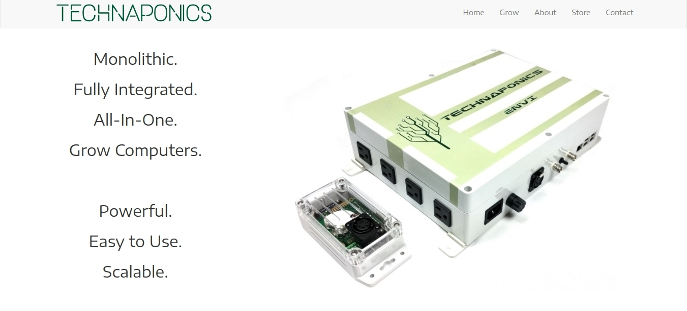
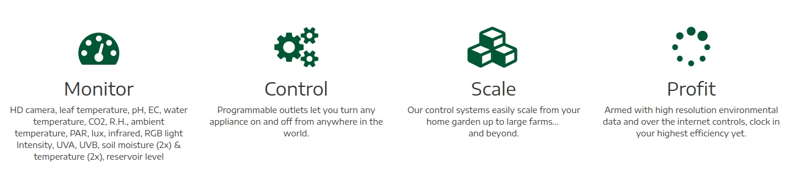
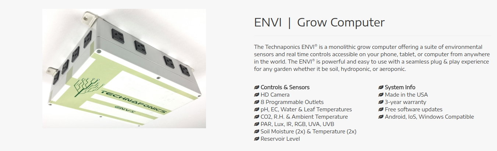
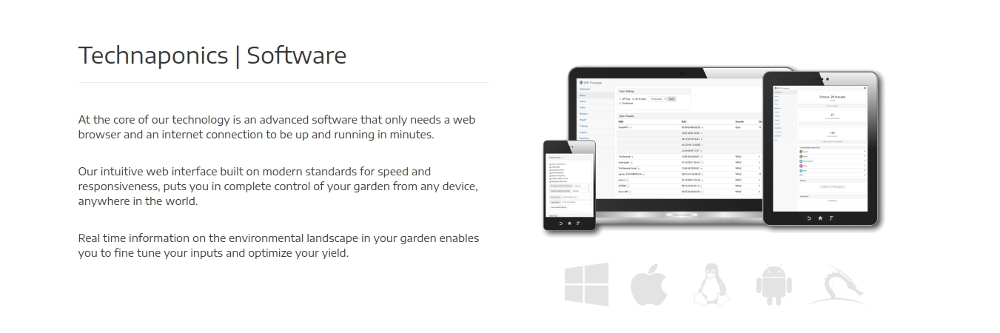
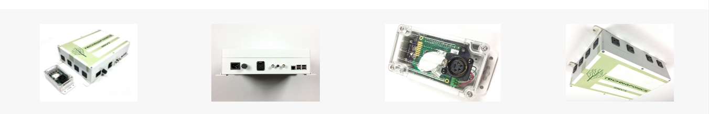
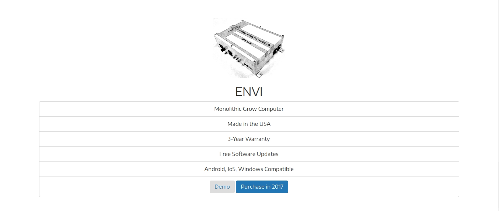
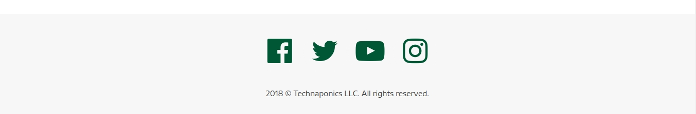

# technaponics-company-website
Company Website Built with Django | Django REST Framework | jQuery | Bootstrap | Gunicorn | NGINX

##### Install Python3 and pip3
$ apt-get install python3 python3-pip
##### Install Django and Django REST Framework
$ pip3 install django djangorestframework
##### Download Source Files
$ curl -LO https://github.com/alexhla/technaponics-company-website/archive/master.zip
##### Unzip
$ unzip master.zip
##### Navigate to Project
$ cd technaponics-company-website/bizweb
##### Start Django Development Server at http://127.0.0.1:8000/
$ python3 manage.py runserver
##### Launch with any Web Browser
$ firefox "http://127.0.0.1:8000/"

	
	
	
	
	
	
	

## Detailed Setup

$ apt-get install python3-pip nginx -y  
$ pip3 install django djangorestframework gunicorn

$ mkdir /srv/technaponics-company-website  
technaponics-company-website$ django-admin.py startproject bizweb

bizweb$ python3 manage.py startapp home  
bizweb$ python3 manage.py startapp grow  
bizweb$ python3 manage.py startapp about  
bizweb$ python3 manage.py startapp store  
bizweb$ python3 manage.py startapp contact  

bizweb/bizweb$ nano settings.py  # configure apps,  staticfiles app

	INSTALLED_APPS = [
		'django.contrib.admin',
		'django.contrib.auth',
		'django.contrib.contenttypes',
		'django.contrib.sessions',
		'django.contrib.messages',
		'django.contrib.staticfiles',
		'rest_framework',
		'home',
		'grow',
		'about',
		'store',
		'contact',
	]
     
	PROJECT_DIR = os.path.dirname(os.path.abspath(__file__))
	STATIC_ROOT = os.path.join(PROJECT_DIR, 'static')
	STATIC_URL = '/static/'

bizweb/bizweb$ nano urls.py  # ROOT_URLCONF (specified in settings.py)

	from django.conf.urls import url, include
	from django.contrib import admin
     
	urlpatterns = [
		url(r'^admin/', admin.site.urls),
		url(r'^', include('home.urls')), 
		url(r'^home/', include('home.urls')),
		url(r'^grow/', include('grow.urls')),   
		url(r'^about/', include('about.urls')),
		url(r'^store/', include('store.urls')),
		url(r'^contact/', include('contact.urls')),
		url(r'^contact/api/', include('contact.api.urls')),
	]

bizweb/home$ nano urls.py  # template URLs downstream from ROOT_URLCONF

	from django.conf.urls import url
	from . import views
     
	urlpatterns = [
		url(r'^$', views.index, name='index'),
	]

bizweb/home$ nano views.py  # takes web request, returns web response (template + engine)

	from django.shortcuts import render
     
	# Create your views here.
	def index(request):
		return render(request, 'home/home.html'

$cd bizweb/home/templates/home  # place app specific html templates here, repeat for other pages  
$cd bizweb/home/static/home  # and static files here (folder structure per staticfiles app)

bizweb/contact/api$ nano urls.py  # contact API URLs downstream from ROOT_URLCONF

	from rest_framework import routers
	from contact.api.views import (listemailViewSet, formcontactViewSet)
     
	router = routers.SimpleRouter()
	router.register(r'listemail', listemailViewSet)
	router.register(r'formcontact', formcontactViewSet, base_name='formcontact')
     
	urlpatterns = []
	urlpatterns += router.urls

bizweb/contact/api$ nano views.py  # views for contact API

	from rest_framework.viewsets import ModelViewSet
	from rest_framework.decorators import detail_route
	from rest_framework.response import Response
	from rest_framework import status
	from django.core.mail import send_mail
     
	# Import Local Models & Serializers
	from contact.models import (listemail, formcontact)
	from contact.api.serializers import (listemailSerializer)
     
	# Create your views here.
	class listemailViewSet(ModelViewSet):
		http_method_names =  ['post']
		queryset = listemail.objects.none()
		serializer_class = listemailSerializer
     
	class formcontactViewSet(ModelViewSet):
		http_method_names =  ['post']
		serializer_class = formcontactSerializer
		queryset = formcontact.objects.none()

bizweb/contact$ nano models.py  # create models to store info received on contact page

	from django.db import models
     
	# Create your models here.
		class listemail(models.Model):
		emails = models.CharField(max_length=256)
     
	class formcontact(models.Model):
		name = models.CharField(max_length=70)
		email = models.CharField(max_length=256)
		msg = models.CharField(max_length=1000)
     
	class formcontactViewSet(ModelViewSet):
		http_method_names =  ['post']
		serializer_class = formcontactSerializer
		queryset = formcontact.objects.none()         

bizweb/contact/api$ nano serializer.py

	from rest_framework.serializers import ModelSerializer
	from contact.models import (listemail, formcontact)
     
	class listemailSerializer(ModelSerializer):
		class Meta:
			model = listemail
			fields = ('id','email')
     
	class formcontactSerializer(ModelSerializer):
		class Meta:
		model = formcontact
		fields = ('id','name', 'email', 'msg')

bizweb/contact$ nano admin.py  # register models with Django's automatic admin interface

	from django.contrib import admin
     
	# Register your models here.
	from contact.models import (listemail, formcontact)
	admin.site.register(listemail)
	admin.site.register(formcontact)

bizweb$ python3 manage.py makemigrations auth  # make migrations  
bizweb$ python3 manage.py makemigrations contact  
bizweb$ python3 manage.py migrate  # reconstruct database schema per makemigrations

bizweb$ python3 manage.py createsuperuser # create user who can login to the admin site

	$ username: admin  
	$ Email address: admin@technaponics.com  
	$ Password: githubdemo  
	$ Password (again): githubdemo  
	$ Superuser created sucessfully.

bizweb$ echo yes | python3 manage.py collectstatic  # collects the static files into STATIC_ROOT  
bizweb$ python3 manage.py runserver # start development server at http://127.0.0.1:8000/

##### Gunicorn + NGINX for service on port 80  
bizweb$ gunicorn bizweb.wsgi:application --threads=3 --reload --bind 127.0.0.1:8000 &

$ nano /etc/nginx/sites-available/default

	server {
		listen [::]:80 ipv6only=off;
		# listen 80 default_server;
		# listen [::]:80 default_server;
		location / {proxy_pass http://127.0.0.1:8000;}  # pass to gunicorn
		location /favicon.ico {alias /srv/technaponics-company-website/bizweb/bizweb/static/home/favicon-T.ico;}
		location /static {alias /srv/technaponics-company-website/bizweb/bizweb/static; expires 7d;}
		location /static/admin {alias /usr/local/lib/python3.4/dist-packages/django/contrib/admin/static/admin; expires 7d;}
		location /static/rest_framework {alias /usr/local/lib/python3.4/dist-packages/rest_framework/static/rest_framework; expires 7d;}
	}
